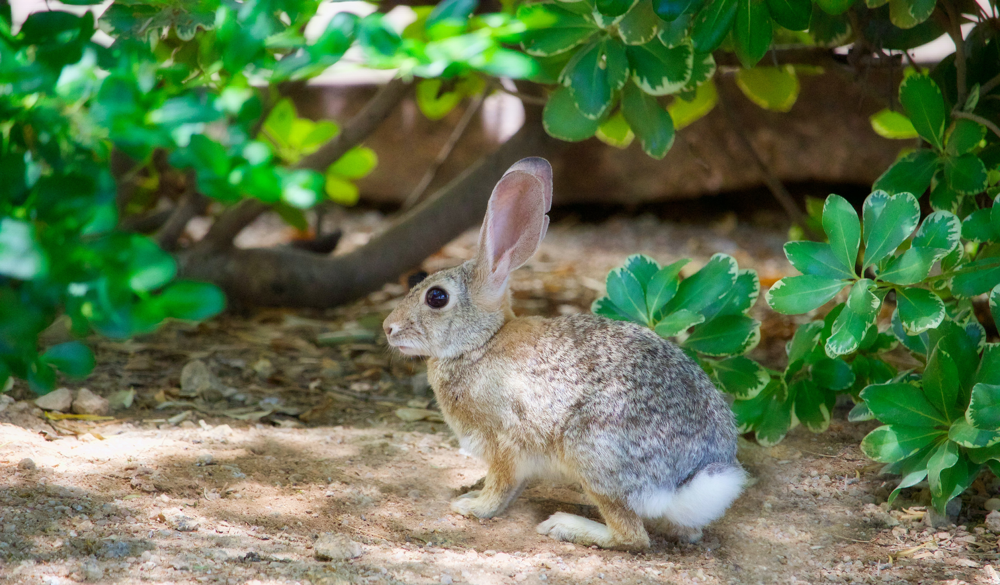

Der **Feldhase** (*Lepus europaeus*), kurz auch **Hase** genannt, ist ein [Säugetier](https://de.wikipedia.org/wiki/S%C3%A4ugetier "Säugetier") aus der [Familie](https://de.wikipedia.org/wiki/Familie_(Biologie) "Familie (Biologie)") der [Hasen](https://de.wikipedia.org/wiki/Hasen "Hasen") (Leporidae). Die Art besiedelt offene und halboffene Landschaften. Das natürliche Verbreitungsgebiet umfasst weite Teile der südwestlichen [Paläarktis](https://de.wikipedia.org/wiki/Pal%C3%A4arktis "Paläarktis"); durch zahlreiche Einbürgerungen kommt der Feldhase heute jedoch auf fast allen Kontinenten vor. Aufgrund der starken Intensivierung der Landwirtschaft ist der Bestand des Feldhasen in vielen Regionen Europas rückläufig. Die [Schutzgemeinschaft Deutsches Wild](https://de.wikipedia.org/wiki/Schutzgemeinschaft_Deutsches_Wild "Schutzgemeinschaft Deutsches Wild") erklärte den Feldhasen für das Jahr 2001 und erneut 2015 zum [Tier des Jahres](https://de.wikipedia.org/wiki/Tier_des_Jahres#Tier_des_Jahres_in_Deutschland "Tier des Jahres").

