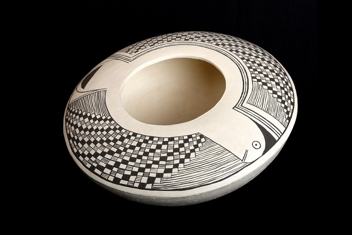

## Den Erinnerungen einen Ausdruck geben

* In Form von einem Gefäß , einer Schale oder Skulptur können Sie der Erinnerung an einen Menschen eine Gestalt geben.

  * Mit der indianischen Aufbautechnik ist es jedem möglich  ohne Vorkenntnisse die gewünschte Form entstehen zu lassen. 

    * Mit meinem Fachwissen stehe ich einfühlsam und begleitend zur Seite, damit das Objekt die gewünschte Form und Stabilität bekommt.

      * Nach dem Aufbau geht es immer mehr in die Feinarbeit. Die Oberfläche kann durch eine Bemalung, polieren , einritzen oder aufsetzten von Elementen am Ende gestaltet werden.

Erat pellentesque dictumst ligula porttitor risus eget et eget. Ultricies tellus felis id dignissim eget. Est augue [maecenas](http://127.0.0.1:8000/) risus nulla ultrices congue nunc tortor. Eu leo risus porta integer suspendisse sed sit ligula elit.

1. Integer varius imperdiet sed interdum felis cras in nec nunc.
2. Quam malesuada odio ut sit egestas. Elementum at porta vitae.

Amet, eu nulla id molestie quis tortor. Auctor erat justo, sed pellentesque scelerisque interdum blandit lectus. Nec viverra amet ac facilisis vestibulum. Vestibulum purus nibh ac ultricies congue.

Erat pellentesque dictumst ligula porttitor risus eget et eget. Ultricies tellus felis id dignissim eget. Est augue maecenas risus nulla ultrices congue nunc tortor.

Eu leo risus porta integer suspendisse sed sit ligula elit. Elit egestas lacinia sagittis pellentesque neque dignissim vulputate sodales. Diam sed mauris felis risus, ultricies mauris netus tincidunt. Mauris sit eu ac tellus nibh non eget sed accumsan. Viverra ac sed venenatis pulvinar elit. Cras diam quis tincidunt lectus. Non mi vitae, scelerisque felis nisi, netus amet nisl.

Eu eu mauris bibendum scelerisque adipiscing et. Justo, elementum consectetur morbi eros, posuere ipsum tortor. Eget cursus massa sed velit feugiat sed ut. Faucibus eros mauris morbi aliquam nullam. Scelerisque elementum sit magna ullamcorper dignissim pretium.